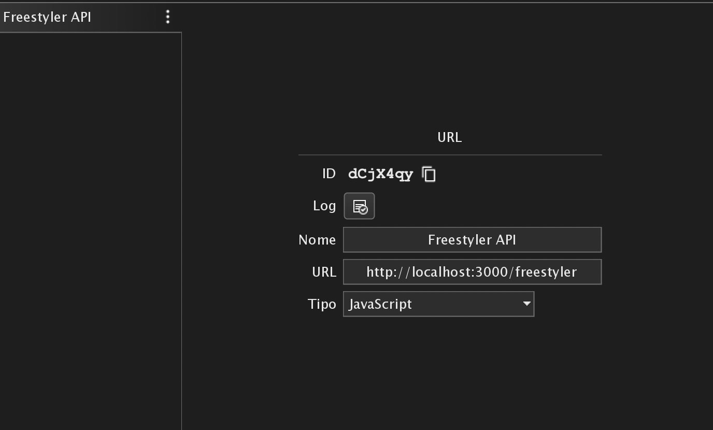

# Freestiler connector API

This repository contains an API to simplify the communication with Freestyle x2 without needing to use TCP sockets and mount complex instructions. The API is built using NodeJs, Typescript and Express.

## API documentation
---
### Connect to Freestyler
`POST /freestyler/connect`
```json
{
    "hostname": "ip/address",
    "port": 3333
}
```

This request is responsible for starting the connection with Freestyler, located at `<hostname>:<port>`. If the connection succeed, the request will be responded with status `200`. Otherwise a messag will be returned with th reason of the failure.

### List cues
`GET /freestyler/cues`

This request will list the available cues at th connected Freestyler instance. These are loaded on connection and cached. If new cues are created, the connection must be refreshed.

### Start and Stop cues
`POST /freestyler/cues/:name/<start|stop>`

This request will start or stop the cue that match with the `name` path parameter. The request is case insensitive. Freestyler does not provide a feedback for such operation. However, it is possible to implement a way to monitor cues status changes, but it is not implemented yet. Now, the request will always be answered with status `200`

## Holyrics integration

To integrate the API with holyrics, one just need to add the following resources:

1. Create a receiver. We can set the type to `Javascript`, allowing us to change the HTTP request method in the calls;

2. Add the following to the Include. All the requests are defined with synchronous execution and we have `logResponse` function to resolve possible request errors.
```javascript
var freestylerReceptorId = "receptorId"

function logResponse(response) {
    var err = h.getApiRequestLastError()
    if(response == null) h.log(err)
    else h.log("Response: " + response)
}

function startConnector(host, port){
    h.log("Setting freestyler connection to " + host + ":" + port)
	var response = h.apiRequest(freestylerReceptorId, {
        url_suffix: '/connect',
        headers: {
            'Content-Type': 'application/json'
          },
        type: 'POST',
        data: {
            "hostname": host,
            "port": port
        }
    });

    logResponse(response)
}

function getCues(){
	var response = h.apiRequest(freestylerReceptorId, {
        url_suffix: '/cues',
        type: 'GET'
    });

    logResponse(response)
}

function startCue(name){
	var response = h.apiRequestAsync(freestylerReceptorId, {
        url_suffix: "/cues/"+name+"/start",
        type: 'GET'
    });

    logResponse(response)
}

function stopCue(name){
	var response = h.apiRequest(freestylerReceptorId, {
        url_suffix: "/cues/"+name+"/stop",
        type: 'GET'
    });

    logResponse(response)
}
```
3. Create scripts using the functions you may need. Example:
```javascript
function scriptAction(obj) {
  startConnector("192.168.0.130", 3333)
  // or
  getCues()
  // or
  startCue("cue1")
  // or
  stopCue("cue1")
}
```